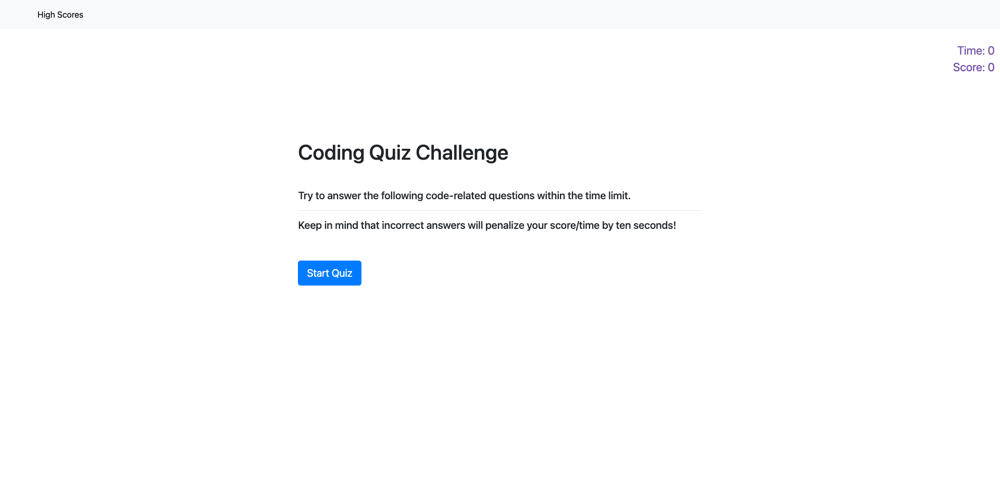

# JavaScript Quiz

A fun and interactive way to test your JavaScript knowledge! This app features a variety of multiple-choice questions on topics such as closures, let vs. var, and hoisting. The top 10 scores will be displayed on a leader board and stored in local storage so you can track your progress over time

## Project Link/Deployed Application 👇

* You can try the live demo of the project at this [@JavaScript Brain Busters](https://constantin-e-t.github.io/JavaScript-Brain-Busters/)

## Table of Contents 🔗

* [Description](#description)
* [Screenshots](#screenshots)
* [Authors](#authors)
* [Skills](#skills)
* [Stack](#stack)
* [License](#license)

## Description

* A set of multiple-choice questions that test your knowledge of JavaScript concepts.

* A timer that keeps track of how long it takes to complete the quiz.

* A scoring system that keeps track of the number of correct answers.

* A high scores page that shows the top 10 scores and allows you to clear the scores.

## Screenshots

## Authors

* [@Constantin-E-T](https://github.com/Constantin-E-T/)

## Skills

Javascript, HTML, CSS, Python, Django

## Stack

* JavaScript
* Bootstrap
* HTML & CSS

## License

[MIT](https://choosealicense.com/licenses/mit/)